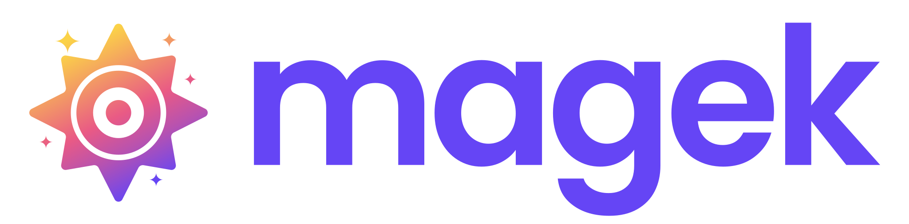

# ✨ Magek — Build AI-Native Backends with Event-Driven Intelligence

> A framework for building intelligent, agentic applications with event sourcing, swarming agents, and LLM integrations — cloud-agnostic and fully open source.

---

## 🧠 What is Magek?

**Magek** is an open-source framework for building modern backends designed for **AI-native applications**. It helps you structure your code using **event sourcing**, run **ambient agents** that operate continuously, and plug into **LLMs, vector databases**, and **retrieval systems** — all from a single, unified developer experience.

Magek was born as a fork and deep refactor of the [Booster Framework](https://github.com/boostercloud/booster), a production-ready event-sourced backend framework. With Magek, we're taking those solid foundations and bringing them into the age of intelligent, agentic applications.

Whether you're building a data ingestion pipeline for LLMs, a Slack agent swarm for your team, or a full RAG-powered assistant with real-time memory and insight — Magek gives you the primitives to do it.

---

## ⚡ Key Concepts

Magek applications revolve around **events**. These are facts that describe what happened in your system. From there, the rest emerges:

- **Commands** – requests from users or agents that trigger intent
- **Events** – immutable records of what happened
- **Entities** – long-lived state projections built from events
- **Event Handlers** – logic that reacts to commands and events
- **Read Models** – objects that enable an access point to query or subscribe to the system state
- **Agents** – long-lived, autonomous workers that observe state and act accordingly, calling to commands and creating events

---

## 🧬 Ambient Agents: The Next Frontier in AI Apps

Unlike synchronous chat-based agents that wait for a user to prompt before reacting, Ambient Agents operate proactively: they run continuously in the background, listening to event streams, maintaining memory over time, and triggering complex workflows when contextually relevant. They can reason asynchronously, coordinate in swarms, and handle multi-step tasks automatically—escalating to humans only when approval is needed—allowing systems to scale beyond on-demand interactions and deliver real-world intelligence without constant human prompting.

Magek’s event-sourced architecture is a perfect match for these agents. Why?

- They keep a **history** of what happened in the system that can be inspected or replayed to understand the context and intent
- They **observe state changes** and react without polling
- They have **memory and purpose**, built from event streams
- They can run asynchronously, coordinate in swarms, or wait for specific signals or human intervention

With Magek, you can define agents that act like smart coworkers — not just API endpoints.

---

## 🔌 Pluggable and Cloud-Agnostic

Magek apps can be run in two ways: either as a **Fastify-powered Node.js server** (perfect for local development or Docker-based deployments), or deploying your app’s root functions directly to your favorite FaaS provider (no Fastify required).

All infrastructure is abstracted behind **adapters**, so you can connect to the tools and databases that make sense for your stack:

- ✅ Event Store: NeDB (development), PostgreSQL, DynamoDB, Redis, etc.
- ✅ Read Model Store: NeDB (development), Vector Databases, SQL, NoSQL, Elasticsearch, etc.
- ✅ Session Store: NeDB (development), Redis, PostgreSQL, etc.
- ✅ Sessions & Auth: Ready to plug with any JWT-based auth system.
- ✅ Deployment: Run anywhere Docker runs, or deploy app functions to FaaS providers without the Fastify server.

Magek gives you full control without sacrificing the developer experience.

---

## 🛠 Features at a Glance

- 🔗 **Implicit API** with GraphQL endpoints auto-generated from your code
- 🔁 **Event-Sourced State** with CQRS separation
- 🤖 **Asynchronous Agents** with internal memory and long-running logic
- 🌐 **LLM & RAG integrations** with tools for embeddings, retrieval, and augmentation
- 🕸 **Agent Swarms**: define collaborative groups of agents with roles and goals, communicating them with events.
- 📥 **Data ingestion pipelines** and streaming interfaces
- 📦 **Pluggable architecture** via adapters (storage, auth, vector DBs, etc.)
- 🚀 **Docker-first** and dev-friendly (Fastify-based)
- 📦 **Serverless-friendly** your app functions can be deployed on FaaS providers.

---

## 🚧 Roadmap Highlights

We’re building Magek in the open. Here’s what’s happening:

- ✅ Core event sourcing + CQRS engine (inherited from Booster Framework)
- ✅ `@magek/server`: Fastify-based runtime (local/Docker)
- ✅ `create-magek`: project scaffolding CLI (`npm create magek@latest`)
- 🚧 Modular DB adapters: PostgreSQL (first), others via community
- 🛠 LLM & RAG integrations: OpenAI, vector DBs, prompt tooling
- 🛠 Agent framework: asynchronous execution, memory, swarming
- 🛠 GraphQL & REST endpoints (auto-generated)

---

## 🙌 Get Involved

Magek is **built in the open**, and we’re just getting started. Whether you're into event-driven systems, AI agents, data engineering, or building amazing dev tools — we’d love your help.

👀 [Star us on GitHub](https://github.com/theam/magek)  
🐛 [Open an issue](https://github.com/theam/magek/issues) to report bugs or request features  
💬 [Start a discussion](https://github.com/theam/magek/discussions) to help define what Magek becomes  
🤝 [Open a PR](https://github.com/theam/magek/pulls) to shape the future of AI infrastructure

### For Maintainers

Releases are created manually via [GitHub Actions workflow dispatch](https://github.com/theam/magek/actions/workflows/publish.yml). See [CONTRIBUTING.md](CONTRIBUTING.md#creating-a-release) for detailed instructions.

---

## 📜 License

The Magek Framework is licensed under the Apache License, Version 2.0. See the [LICENSE](LICENSE) file for more details.

---

## Resources

- [Website](https://magek.ai)
- [Documentation](https://magek.ai/docs)
- [Join the conversation on GitHub Discussions](https://github.com/theam/magek/discussions)

> “Magek” was the Guanche deity of the sun — a symbol of light and insight. We believe your backends should reflect that: continuously aware, reactive, and illuminating.
